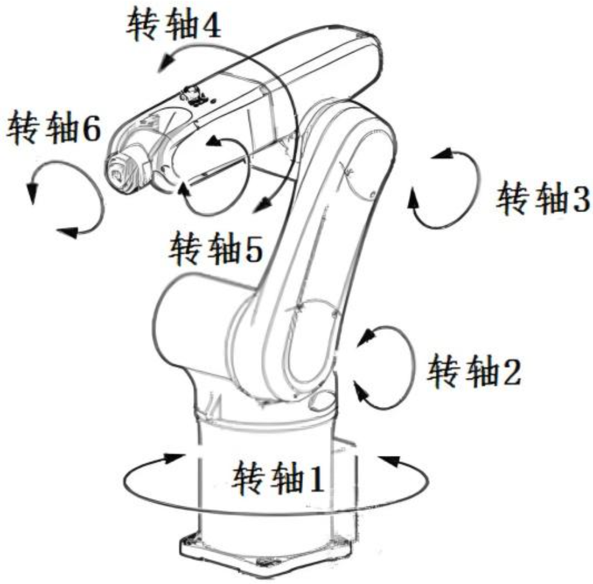
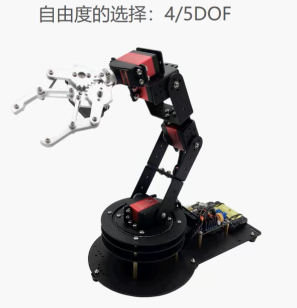
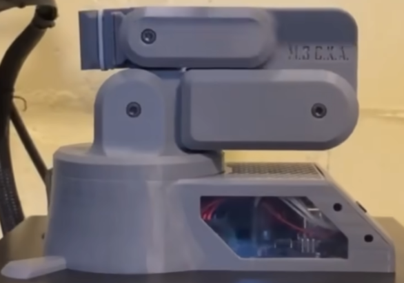
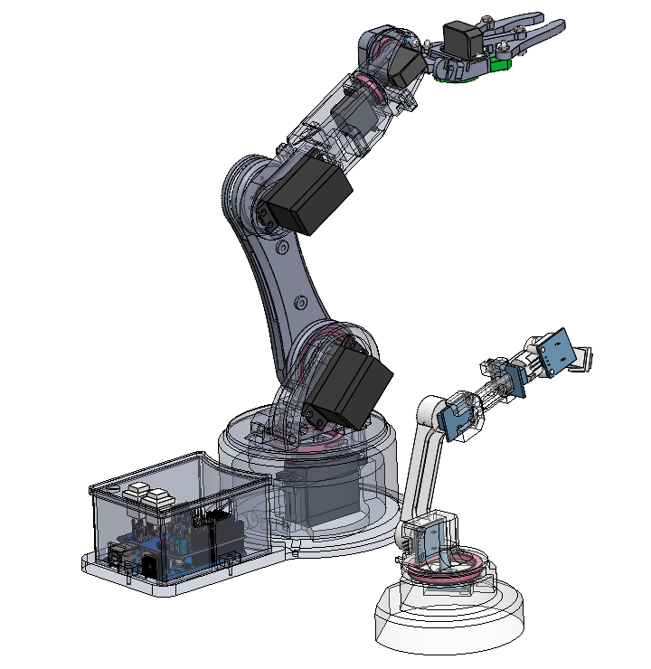
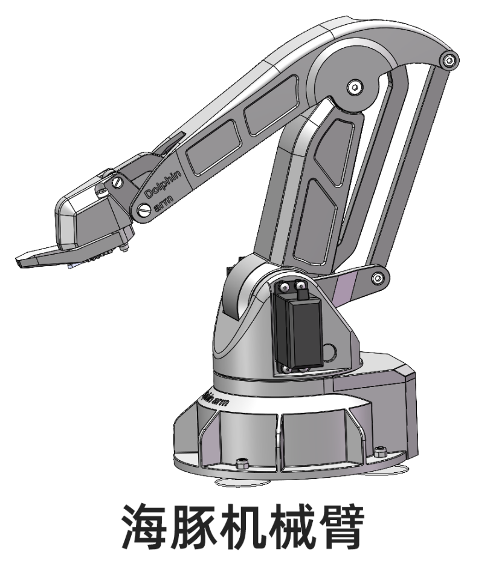
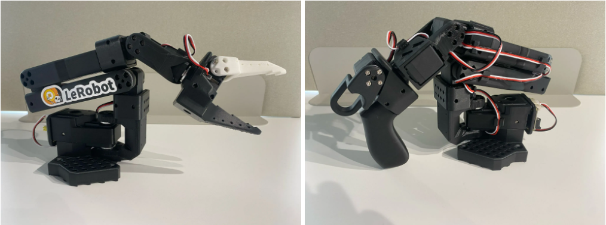
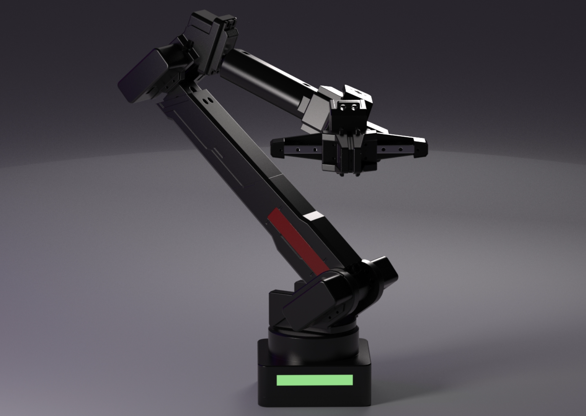
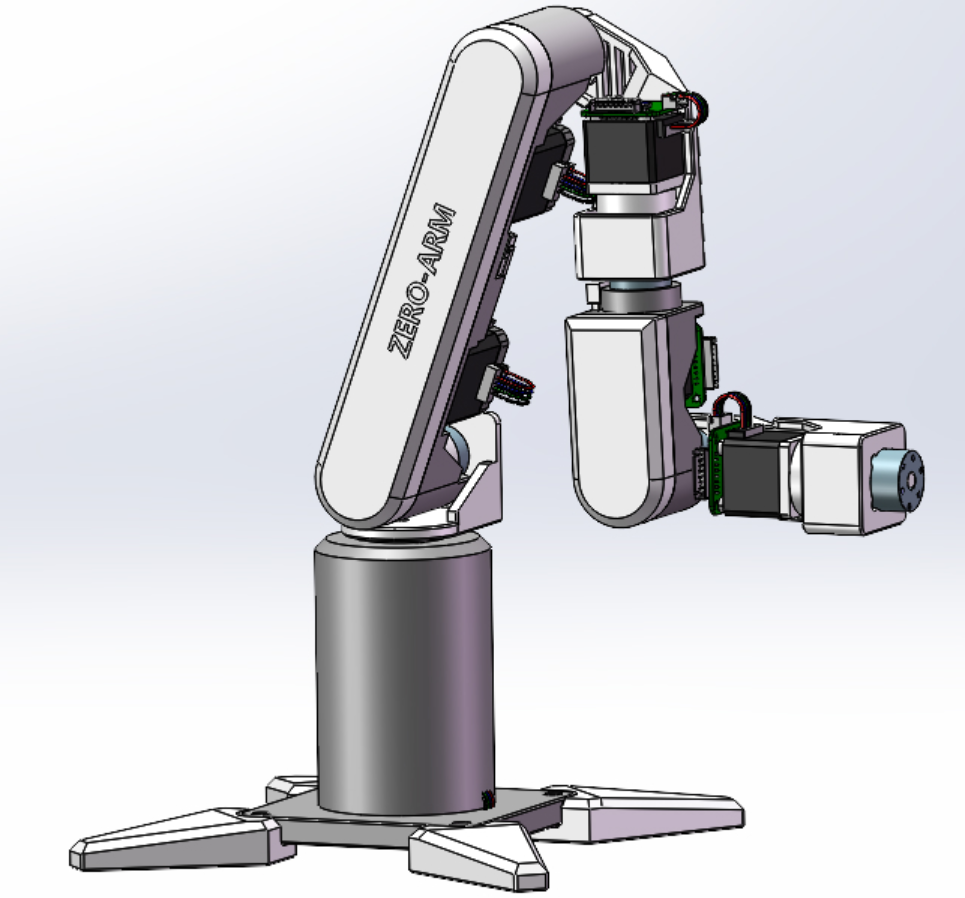
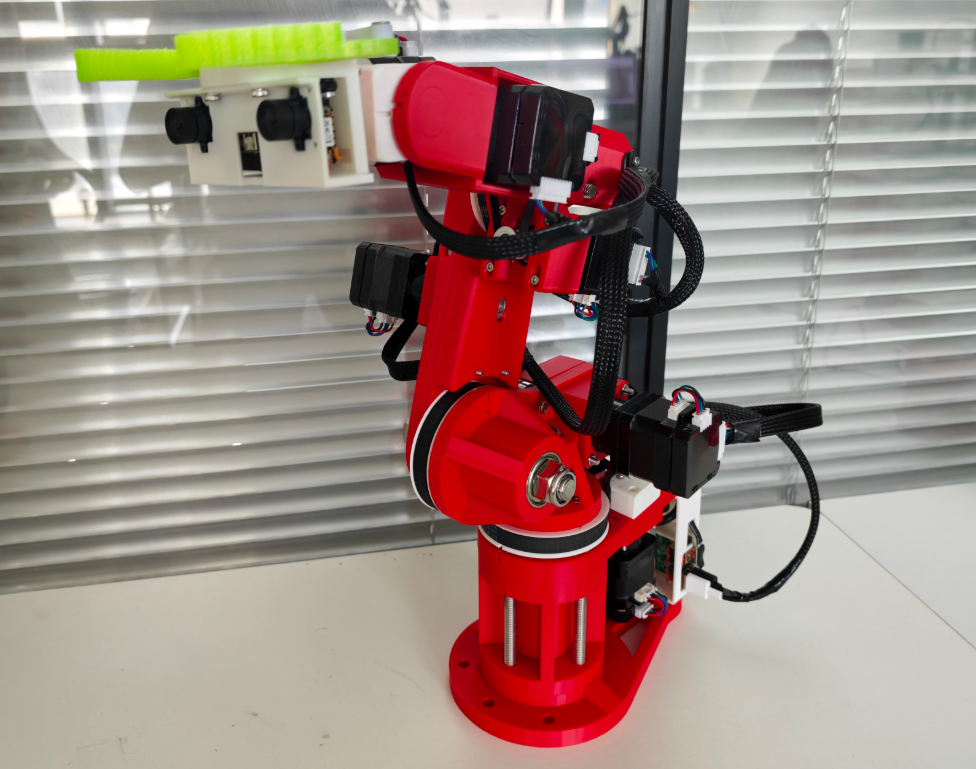
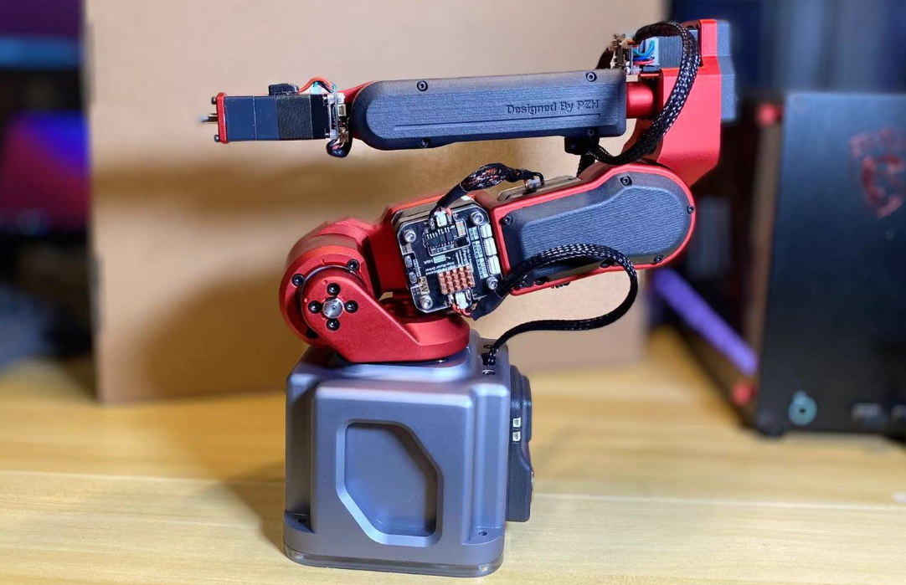

# 🤖 机械臂开源项目研究笔记

> 一份面向**新手 → 进阶**的机械臂开源项目研究笔记，帮你从「看个热闹」🚶 到「动手复刻」🔧。
>
> 本文件基于 [`机械臂.md`](机械臂.md) 整理重构，补充了**机械臂核心知识**、**项目横向对比**与**学习路线**，更适合在 GitHub 上阅读浏览。

---

## 📑 目录

- [📖 前言](#preface)
- [🧠 机械臂核心知识速览（新手必修）](#core)
  - [1. 自由度（DoF）是什么](#dof)
  - [2. 驱动方式三选一：舵机 / 步进 / 无刷伺服](#drive)
  - [3. 减速器三兄弟：行星 / 谐波 / RV](#reducer)
  - [4. 零基础学习路线](#learn-path)
- [🚀 开源项目总览（选型速查表）](#overview)
- [🎯 舵机驱动机械臂 —— 低成本入门](#servo)
  - [🍼 极简示例项目](#demo-project)
  - [🌍 国外开源机械臂](#foreign-open)
  - [🏗️ 悬臂工坊机械臂](#cantilever)
  - [🐬 海豚机械臂](#dolphin)
  - [🐢 LeRobot / SO-ARM100 / SO-ARM101](#lerobot)
- [⚙️ 电机驱动机械臂 —— 高精度进阶](#motor)
  - [🟢 ZERO 机械臂](#zero)
  - [🏭 6 轴 Agent 机械臂](#agent6)
  - [🤏 Picker Robot](#picker)
  - [🔧 reBot 机械臂](#rebot)
  - [🏆 稚晖君 Dummy-Robot（终极目标）](#dummy)
- [🧰 其他开源项目合集](#others)
- [📚 学习资源推荐](#resources)
- [⚠️ 安全提示](#safety)
- [📝 更新日志](#changelog)

---

## 📖 前言

> 🎥 入门必看：[机械臂基础（B 站）](https://www.bilibili.com/video/BV11t4y1C76N/)

机械臂是 **机器人学最经典的入门载体**，也是当下 **具身智能（Embodied AI）** 浪潮中最容易上手的实践平台。从几十元的舵机玩具到几万元的全栈机器人，开源社区已经给出了一条完整的成长阶梯。

这份笔记收录了我调研过的各类开源机械臂项目，按照 **驱动方式** 分为两大类：

| 分类 | 代表项目 | 特点 |
| --- | --- | --- |
| 🎯 **舵机驱动** | 国外开源 / 悬臂工坊 / 海豚 / LeRobot | 💰 便宜 · 🛠️ 简单 · 📦 适合入门 |
| ⚙️ **电机驱动** | ZERO / 6轴Agent / Picker / reBot / Dummy | 🎯 精度高 · 🔧 工程量大 · 🧠 适合进阶 |

---

## 🧠 机械臂核心知识速览

> 这部分是结合公开资料整理的「认知地图」，先建立框架，再动手实践效率最高。

### 1. 自由度（DoF）是什么

机械臂的**自由度（Degree of Freedom）**指独立可控的关节数量，每个旋转/移动关节贡献一个自由度。

- **3 自由度**：只能到达三维空间中的某个点，**姿态不可控**（如 SCARA 取放）。
- **4 / 5 自由度**：姿态部分可控，常在低成本玩具臂上出现，**常被商家误标为"六自由度"** ❗。
- **6 自由度**：末端可在空间中**任意定位 + 任意定姿**，是通用工业机械臂的基本配置 ✅。
- **7 自由度**：冗余自由度，多一个轴用于**避障 / 优化姿态**（如 KUKA iiwa、UR 系列）。

🖼️ 六自由度 vs 四/五自由度 对比图

**✅ 六自由度机械臂（真正的 6 DoF）**

**⚠️ 四/五自由度机械臂（常被误解成六自由度）**

> 💡 判断技巧：数一数**能独立运动的关节数**，而不是电机数量。很多玩具臂只是"电机多"，关节自由度并不够。

### 2. 驱动方式三选一：舵机 / 步进 / 无刷伺服

| 驱动方式 | 位置控制 | 速度控制 | 力矩控制 | 精度 | 成本 | 适合场景 |
| --- | :-: | :-: | :-: | :-: | :-: | --- |
| 🎛️ **普通舵机** | ✅ | ❌ 不连续 | ❌ | 低 | 💰 低 | 入门玩具、低成本演示 |
| 🪜 **步进电机 + 减速器** | ✅ | ✅ | ✅（力矩较小，靠减速器增扭） | 中 | 💰💰 | 自制机械臂主流方案 |
| 🧲 **无刷伺服（BLDC + FOC + 编码器）** | ✅ | ✅ | ✅ 力矩大 | 高 | 💰💰💰 | 协作机械臂、人形机器人 |

> 📌 结论：**预算紧张/练手选舵机**，**追求精度与工程价值选步进 + 减速器**，**不差钱/搞研究选无刷伺服**。选型直接决定关节的动态上限、控制带宽与集成难度。 [cite:7ac6cc53-2]

### 3. 减速器三兄弟：行星 / 谐波 / RV

电机转速快、扭矩小，必须通过减速器转换为「低速大扭矩」。机械臂关节里最常见的是三种精密减速器：

| 类型 | 特点 | 常用位置 |
| --- | --- | --- |
| 🪐 **行星减速器** | 结构紧凑、成本友好、通用性强 | 自制臂主流（ZERO / 6轴Agent 都在用） |
| 🌊 **谐波减速器** | 小体积内做到高减速比 + 高精度 | 协作臂关节（Dummy 机械臂使用） |
| 🏋️ **RV 减速器** | 刚度高、抗冲击、重载 | 工业机器人重载关节 |

> 💡 简单记忆：**行星 = 性价比通用，谐波 = 紧凑高精度，RV = 重载硬骨头**。 [cite:7ac6cc53-3]

### 4. 零基础学习路线

**Step 1｜理论基础（1~2 个月）**
- 📖 教材：John Craig《Introduction to Robotics: Mechanics and Control》（机器人学导论），配套斯坦福 Oussama Khatib 教授的公开课视频，B 站/YouTube 均可找到。 [cite:0b4dfc28-1]
- 📺 中文教程：[B 站机械臂运动学教程（林沛群）](https://www.bilibili.com/video/BV1oa4y1v7TY/)——覆盖旋转矩阵 → 变换矩阵 → DH 建模 → 逆解 → 轨迹规划全流程。 [cite:0b4dfc28-2]

**Step 2｜核心概念（对照项目理解）**
- **DH 参数**：连杆长度 $a_i$、连杆扭转 $\alpha_i$、连杆偏移 $d_i$、关节角 $\theta_i$——描述机械臂几何的"标准语言"。 [cite:0b4dfc28-3]
- **正运动学（Forward Kinematics）**：给定关节角 → 求末端位姿。
- **逆运动学（Inverse Kinematics）**：给定末端位姿 → 求关节角（更常用、更难）。
- **轨迹规划 / 雅可比矩阵 / 动力学**：进阶内容。

**Step 3｜动手实践（按项目爬升）**
1. 🍼 舵机玩具臂 → 理解 PWM 控制
2. 🐢 LeRobot 双臂 → 遥操作 + 数据采集 + 模仿学习
3. 🟢 ZERO → 步进 + 减速器 + PID + 运动学仿真
4. 🏆 Dummy → 谐波减速 + FOC + 上位机，全栈通关

> 📌 一句话：**先啃 Craig，再玩 LeRobot，最后挑战 Dummy**。

---

## 🚀 开源项目总览（选型速）

| 项目 | 驱动方式 | 预估成本 | 精度 | 复刻难度 | 推荐人群 | 推荐度 |
| --- | --- | ---: | --- | --- | --- | --- |
| 🌍 国外开源臂 | 舵机 | 💰 低 | 低 | ⭐ | 看思路、练手 | ⭐⭐ |
| 🏗️ 悬臂工坊 | 舵机 | ≈ ¥300 | 低 | ⭐ | 新手练手 | ⭐⭐ |
| 🐬 海豚机械臂 | 舵机 | ≈ ¥206 | 低 | ⭐ | 学舵机控制 / 正逆解 | ⭐⭐⭐ |
| 🐢 LeRobot / SO-ARM | 总线舵机 | ¥682 ~ ¥1343 | 中 | ⭐⭐⭐ | 学具身智能 / 模仿学习 | ⭐⭐⭐⭐⭐ |
| 🟢 ZERO 机械臂 | 步进 + 行星减速 | ≈ ¥1000+ | 中 | ⭐⭐⭐ | 学步进工程方案 | ⭐⭐⭐⭐ |
| 🏭 6 轴 Agent | 步进 + 减速器 | ≈ ¥2000 | 高 | ⭐⭐⭐⭐ | 学高精度工程化 | ⭐⭐⭐⭐ |
| 🤏 Picker Robot | 步进 / 无刷伺服 | 较高 | 高 | ⭐⭐⭐⭐ | 学工业级 AR4 方案 | ⭐⭐⭐⭐ |
| 🔧 reBot 机械臂 | 无刷伺服 | ≈ ¥8000 | 高 | ⭐⭐⭐⭐⭐ | 参考软件 / 有预算者 | ⭐⭐⭐ |
| 🏆 稚晖君 Dummy | 步进 + 谐波 | 最高 | 很高 | ⭐⭐⭐⭐⭐ | 终极复刻目标 | ⭐⭐⭐⭐⭐ |

> 💡 **快速建议**：入门选 🐬 或 🐢；进阶选 🟢 或 🏭；终极挑战选 🏆。

---

## 🎯 舵机驱动机械臂 —— 低成本入门

> **舵机驱动机械臂**整体特点：
>
> - ✅ 价格便宜
> - ✅ 开发简单
> - ✅ 位置控制
> - ❌ 速度连续（无法连续变速）

---

### 🍼 极简示例项目

> 📝 一个简单的示例项目：极其基础，适合新手尝试，没有工程价值 😄

- 🎥 [视频链接](https://www.bilibili.com/video/BV1fHgi6FE4G/)
- 📦 [项目开源（夸克网盘）](https://pan.quark.cn/s/5dcf7ffe65d7)

---

### 🌍 国外开源机械臂

| 项目信息 | 内容 |
| --- | --- |
| 🎯 定位 | 参考思路，不建议复刻 |
| 📊 自由度 | 目测 4 自由度 |
| 📌 备注 | 资料已下载到本地 |

> 💭 目测估计是 4 自由度的，没有复刻的意义，但是可以参考思路。

**🎥 相关视频**
- [电位器同步](https://www.bilibili.com/video/BV11k9uYCE9Q/)
- [改良版 ESP32 开源机械臂](https://www.bilibili.com/video/BV11UNxzVE3M/)

**🔗 项目地址**
- [改良版软件（GitHub）](https://github.com/Linyings/ESP32_WROOM_IDF_Rebot_wifi.git)
- [新的 STL / 代码 / 接线图（Printables）](https://www.printables.com/model/818975-compact-robot-arm-arduino-3d-printed)
- [CAD 文件链接（Google Drive）](https://drive.google.com/drive/folders/1x4P8AquQILwCp8e5CiRJLfVJiJn2U4cF)

📦 物料 BOM

> ⚠️ 部分资料下载到本地了，这个要一点魔法 🌐……

待整理 🕐

---

### 🏗️ 悬臂工坊机械臂

| 项目信息 | 内容 |
| --- | --- |
| 🎯 定位 | 低成本硬件方案（约 300 元） |
| 💰 成本 | ≈ ¥300 |
| 📌 备注 | 软件资料零散，仅参考硬件 😤 |

> 😠 软件资料过于零散，宣传与实际不相符合（找资料给我气死了）。只考虑参考硬件（但是同样气人）。

**🎥 相关视频**
- [悬臂工坊机械臂（B 站）](https://www.bilibili.com/video/BV1Av1DBhEvJ/)
- [参考复刻案例](https://www.bilibili.com/video/BV123UPB3Emv/)

**🔗 对应资料**
- [Arduino 机械臂示教器控制（百度网盘）](https://pan.baidu.com/s/18lIVENKiHGxvixbGkezVOg?pwd=0000)
- [STM32 机械臂示教器控制（百度网盘）](https://pan.baidu.com/s/1pK1BV2AzqLhjEJGuWgYruQ?pwd=0000)
- [视觉识别机械臂全套资料（百度网盘）](https://pan.baidu.com/s/1DuqBgIYC00XxCRNfWLsoJQ?pwd=0000)
- [Arduino—PS2 手柄控制（百度网盘）](https://pan.baidu.com/s/1oT1v3Qng_pT_8TcRDGgYUg?pwd=0000)
- [Arduino 机械臂蓝牙控制.zip（百度网盘）](https://pan.baidu.com/s/16pz9rb_YZsQQieCI2A47nQ?pwd=0000)
- 🖨️ 3D 模型预览：[SLDASM](https://www.zjy1994.com/upload) · [3mf](https://trellis2.app/zh/3d-viewer/3mf-viewer)

**⚠️ 缺点一览**
- PCB 看起来不怎么样
- 3D 零件如给
- 软件代码初步看起来写得一般
- 功能实现单一
- 只有 STM32 和 Arduino 版本

📦 机械臂物料 BOM

**基础零件**

| 名称 | 型号 | 数量 | 单价 (元) | 总价 (元) |
| ---------------- | ---------------------- | ---- | -------- | --------- |
| 自复位按钮开关 | DS430 黑色 + 红色 | 2 | 6 | 12 |
| MG90S 14 克舵机 | MG90S 14 克舵机 180 度 | 3 | 26.5 | 38.9 |
| MG995 舵机 | MG995 舵机（180°） | 3 | 33.9 | 58.05 |
| 电位器模块 | 旋转电位器 | 5 | 3.6 | 18 |
| 十字圆头螺丝 | M3\*18 | 1 | 3.46 | 3.46 |
| 十字圆头螺丝螺帽 | M3 | 1 | 1.16 | 1.16 |
| KA 镀镍微型十字沉头自攻平头电子螺丝钉 | 镀镍 KA2\*10【100 颗】 | 1 | 4 | 4 |

**控制板**

| 名称 | 型号 | 数量 | 单价 (元) | 总价 (元) |
| -------------------- | --------------------------------------- | ---- | --------- | --------- |
| Arduino UNO | Arduino UNO R3 改进版（贴片板）+ 数据线 | 1 | 30 | 30 |
| R3 开发板 UNO 扩展板 | 黑色排针 UNO R3 扩展板 V5.0 | 1 | 7.28 | 7.28 |
| 双路舵机测试板 | 旋钮舵机测试版 | 1 | 33.36 | 33.36 |
| 电路板飞线 | 黑色 | 1 | 18.98 | 18.98 |
| 电路板飞线 | 红色 | 1 | 18.98 | 18.98 |

---

### 🐬 海豚机械臂

| 项目信息 | 内容 |
| --- | --- |
| 🎯 定位 | 舵机入门 · 学习想法多 · 资料很全 |
| 💰 成本 | ≈ ¥206（BOM 合计）|
| 📊 自由度 | 较低 |
| ⭐ 推荐度 | 🌟🌟🌟 |

> 💭 自由度还是偏低了，意义不大，但是涉及到很多可以学习的想法，资料很全。

**🎥 相关视频**
- [机械臂控制、数字孪生、正逆解项目教程](https://www.bilibili.com/video/BV1iu411b7WE/)

**🔗 项目地址**
- [复刻文档（飞书）](https://ifcski218x.feishu.cn/docx/TJXEd4p2WotcQYxc7mecSGZrnrd)

📦 物料 BOM

| 名称 | 链接 | 单价 | 数量 | 小计 |
| -------------------- | ----------------------------------------------- | ------: | ----: | -----------: |
| 标准舵机 | MG996 180度 | ¥25.80 | 3 | ¥77.40 |
| 舵机MG90s | 模拟MG90S 90-180度 | ¥16.21 | 1 | ¥16.21 |
| M10×50螺丝 | M10×50螺丝 | ¥0.88 | 1 | ¥0.88 |
| M10防松螺母 | M10防松螺母 | ¥0.34 | 1 | ¥0.34 |
| M3×12轴肩螺丝 | 轴肩螺丝 | ¥0.78 | 5 | ¥3.92 |
| M4×20轴肩螺丝 | | ¥0.96 | 1 | ¥0.96 |
| M4×30轴肩螺丝 | | ¥1.12 | 1 | ¥1.12 |
| M3×30轴肩螺丝 | | ¥1.04 | 2 | ¥2.08 |
| M3×12圆柱头螺丝 | M3×12圆柱头螺丝 | ¥0.06 | 8 | ¥0.48 |
| M3×12自攻螺丝 | M3×12自攻螺丝 | ¥0.05 | 8 | ¥0.40 |
| M3×12一字轴肩螺丝 | 一字轴肩螺丝 | ¥2.00 | 1 | ¥2.00 |
| M4×25一字轴肩螺丝 | | ¥3.00 | 1 | ¥3.00 |
| M1.4×5自攻螺丝 | M1.4×5自攻螺丝 | | 9 | |
| M3防滑螺母 | M3防滑螺母 | ¥0.09 | 8 | ¥0.72 |
| M3防滑螺母 平底 | M3防滑螺母 平底 | ¥0.36 | 4 | ¥1.44 |
| M4防滑螺母 | M4防滑螺母 | ¥0.10 | 3 | ¥0.30 |
| m10螺母 | m10螺母 | ¥0.20 | 1 | ¥0.20 |
| 轴承619-5 | 轴承619-5(695ZZ) | ¥0.55 | 2 | ¥1.10 |
| 轴承61900 | 轴承61900 | ¥0.98 | 1 | ¥0.98 |
| 轴承61809 | 轴承61809 | ¥5.20 | 1 | ¥5.20 |
| 易格斯轴承GFM-04050-04 | 易格斯轴承GFM-04050-04 | ¥3.80 | 12 | ¥45.60 |
| 易格斯轴承GFM-0506-05 | 易格斯轴承GFM-0506-05 | ¥3.30 | 6 | ¥19.80 |
| 同步带 | 同步带：STS 264-S3M-6mm宽带宽（mm） | ¥5.50 | 1 | ¥5.50 |
| 螺丝刀 | 螺丝刀：黑批十字3.0 | ¥2.50 | 1 | ¥2.50 |
| 六角匙 | 六角匙：CRV平头发黑8.0mm/4支 | ¥1.35 | 1 | ¥1.35 |
| 舵机延长线 | 60芯并线棕红橙 200mm 2根 | ¥1.60 | 2 | ¥3.20 |
| 舵机延长线 | 60芯并线棕红橙 500mm 1根 | ¥2.20 | 1 | ¥2.20 |
| 磁铁 | 直径3mm、厚度4mm | ¥0.21 | 8 | ¥1.68 |
| 吸盘 | 3.2cm螺杆M4吸盘配螺母3个 | ¥1.95 | 4 | ¥5.85 |
| **总计** | | | | **¥206.41** |

---

### 🐢 LeRobot / SO-ARM100 / SO-ARM101

| 项目信息 | 内容 |
| --- | --- |
| 🎯 定位 | 千元级最具价值的开源 AI 机械臂 |
| 💰 成本 | 单臂 ≈ ¥682 / 双臂 ≈ ¥1343 |
| 📊 自由度 | 6 轴（SO-101 为下一代升级款）|
| ⭐ 推荐度 | 🌟🌟🌟🌟🌟 |
| 📌 亮点 | 配合 🤗 LeRobot 库，玩转**遥操作 + 数据采集 + 模仿学习** |

> 💭 千元级别，舵机中最有价值的，可以学习到很多前沿知识，原项目在 Hugging Face 中也有。

> 📌 **项目背景**：SO-100 / SO-101 由 TheRobotStudio 与 Hugging Face 合作设计，可与开源 🤗 LeRobot 库无缝配合，是学习**端到端具身智能**的低门槛平台（Apache-2.0 协议，GitHub 7.2k+ Stars）。 [cite:4f97d428-1]

**🎥 相关视频**
- [千元级开源 AI 机械臂](http://bilibili.com/video/BV1A2MyzuEfr/)
- [电子羊公社](https://www.bilibili.com/video/BV1muUPBkE33/)
- [微雪电子 SO-ARM100 / 101 开源 6 轴机械臂 组装教程](https://www.bilibili.com/video/BV1bBmxBuEAt/)

**🔗 项目地址**
- [lerobot（GitHub）](https://github.com/hexchip/lerobot-on-ascend)
- [复刻文档教程（Read the Docs）](https://escommune.readthedocs.io/)
- [FlashRT](https://github.com/flashrt-project/FlashRT)
- [SO-ARM100 原项目（GitHub）](https://github.com/TheRobotStudio/SO-ARM100)

**🖥️ 软件上手**

> ⚠️ 不具备，电脑太拉胯了，显卡不是 N 卡 😢

- git
- conda
- PyTorch
- vscode / pycharm
- 最低 3060 6G 笔记本电脑（Windows 10 或 Ubuntu 24.04）
- 千元 6 自由度机械臂（SO-101 ARM）

**🧠 知识链**

待完善 🕐

📦 物料 BOM

**双机械臂（Follower + Leader）**

| Part | Amount | Unit Cost (RMB) | Buy CN |
|---|---:|---:|---|
| STS3215 舵机 1/345 (C001) | 7 | ￥97.72 | 淘宝 |
| STS3215 舵机 1/191 (C044) | 2 | ￥97.72 | - |
| STS3215 舵机 1/147 (C046) | 3 | ￥97.72 | - |
| 电机控制板 | 2 | ￥27 | 淘宝 |
| USB-C 线 2条 | 1 | ￥23.9\*2 | 淘宝 |
| 电源 | 2 | ￥22.31 | 淘宝 |
| 桌面夹 4个 | 1 | ￥5.2\*4 | 淘宝 |
| 螺丝刀套装 | 1 | ￥14.9 | 淘宝 |
| **总计** | --- | **￥1343.16** | --- |

**单 Follower 臂**

| Part | Amount | Unit Cost (RMB) | Buy CN |
|---|---:|---:|---|
| STS3215 舵机 1/345 (C001) | 6 | ￥97.72 | - |
| 电机控制板 | 1 | ￥27 | 淘宝 |
| USB-C 线 2条 | 1 | ￥23.9 | 淘宝 |
| 电源 | 1 | ￥22.31 | 淘宝 |
| 桌面夹 2个 | 1 | ￥7.8 | 淘宝 |
| 螺丝刀套装 | 1 | ￥14.9 | 淘宝 |
| **总计** | --- | **￥682.23** | --- |

**原文 BOM**

> 🔗 完整多地区价格表（US / EU / RMB / JPY）：[Parts For Two Arms (Follower and Leader Setup)](https://github.com/TheRobotStudio/SO-ARM100/blob/main/README.md#parts-for-two-arms-follower-and-leader-setup)

| Part | Amount | Unit Cost (RMB) | Buy CN |
|---|---:|---:|---|
| STS3215 Servo 7.4V, 1/345 gear (C001) | 7 | ￥97.72 | 淘宝 |
| STS3215 Servo 7.4V, 1/191 gear (C044) | 2 | ￥97.72 | - |
| STS3215 Servo 7.4V, 1/147 gear (C046) | 3 | ￥97.72 | - |
| Motor Control Board | 2 | ￥27 | 淘宝 |
| USB-C Cable 2 pcs | 1 | ￥23.9\*2 | 淘宝 |
| Power Supply | 2 | ￥22.31 | 淘宝 |
| Table Clamp 4pcs | 1 | ￥5.2\*4 | 淘宝 |
| Screwdriver Set | 1 | ￥14.9 | 淘宝 |
| **Total** | --- | **￥1343.16** | --- |

> 💡 你可以直接在 [Alibaba](https://www.alibaba.com/product-detail/6PCS-7-4V-STS3215-Servos-for_1601428584027.html) 上购买 SO-101 主臂所需的 **全部 6 个 STS3215 舵机**（3 × 1/147 (C046) + 2 × 1/191 (C044) + 1 × 1/345 (C001)）。

| Part | Amount | Unit Cost (RMB) | Buy CN |
|---|---:|---:|---|
| STS3215 Servo 7.4V, 1/345 gear (C001) | 6 | ￥97.72 | 淘宝 |
| Motor Control Board | 1 | ￥27 | 淘宝 |
| USB-C Cable 2 pcs | 1 | ￥23.9 | 淘宝 |
| Power Supply | 1 | ￥22.31 | 淘宝 |
| Table Clamp 2pcs | 1 | ￥7.8 | 淘宝 |
| Screwdriver Set | 1 | ￥14.9 | 淘宝 |
| **Total** | --- | **￥682.23** | --- |

> 💡 不需要使用完全相同的螺丝刀套装，但强烈建议准备 **#0 和 #1 十字螺丝刀**，这两种是标准尺寸，几乎任何小螺丝刀套装里都会有。

---

## ⚙️ 电机驱动机械臂 —— 高精度进阶

> **电机驱动机械臂**整体特点：
>
> - **机器人关节电机**（无刷伺服）
>   - ✅ 位置控制
>   - ✅ 速度控制
>   - ✅ 力矩控制
>   - ✅ 力矩较大
>   - ❌ 特别贵 💸
> - **步进电机 + 减速器**
>   - ✅ 位置控制
>   - ✅ 速度控制
>   - ✅ 力矩控制
>   - ✅ 力矩较小、配合减速器增大扭矩

---

### 🟢 ZERO 机械臂

| 项目信息 | 内容 |
| --- | --- |
| 🎯 定位 | 六关节，值得复刻的步进方案 |
| 💰 成本 | 一代 ≈ ¥1000 / 一代 BOM ≈ ¥1400 |
| 📊 自由度 | 6 轴 |
| ⭐ 推荐度 | 🌟🌟🌟🌟 |

> 💭 六关节，我比较想复刻的一个，资料也很全，成本估计 1000 左右。

**一代机**

**二代机**

**🎥 相关视频**

- [一代组装视频](https://www.bilibili.com/video/BV1d63Dz7ERN/)
  - ✅ 机械臂结构设计（已完成 2025-07-09）
  - ✅ 机器人运动学逆解（已完成 2025-07-09）
  - ✅ PID 控制（已完成 2025-07-09）
  - ✅ 串口控制（已完成 2025-07-09）
  - ✅ 手柄控制（已完成 2025-07-09）
  - 🕐 MQTT 远程控制
  - 🕐 WEB 可视化平台
  - 🕐 语音识别
  - 🕐 语音合成
  - 🕐 大模型接入
  - ✅ 数据收集及强化学习（已完成 2025-10-21）

- 📚 书籍推荐：**《机器人学 建模、控制与视觉（第 2 版）》**

**🔗 项目地址**

- [零一造物_ZERO 机械臂（Gitee）](https://gitee.com/dearxie/zero-robotic-arm)
  - `Model`：机械臂三维模型文件
  - `Software`：存放所有代码类文件
    - `robot`：机械臂嵌入式控制代码
  - `Simulink`：运动学仿真模型
  - `BOM`：物料清单
  - `Deep LR`：待整理
- [ZYArm-X1（GitHub）](https://github.com/ZYAI-Robot/ZYArm-X1)
  - `docs/`：面向学习者、客户、教师、科研和二开的使用文档
  - `firmware/`：STM32 固件工程（Keil / STM32Cube 项目结构）
  - `web/`：Web 控制端工程（前端项目结构）
  - `hardware/`：硬件参考资料和配置文件
  - `software/`：上位机侧 SDK、ROS 2、LeRobot、示例、诊断和工具
  - `data/`：学习数据、运行日志等本地数据
  - `openspec/`：架构和功能变更规格

📦 一代物料 BOM（≈ ¥1400）

| 序号 | 物料名称 | 规格 | 数量 | 价格 | 链接 |
| :-- | ------------ | ------------------------- | --: | --- | --- |
| 1 | 行星减速器 | 51:1 减速 PLZ | 2 | | [🔗](https://item.taobao.com/item.htm?id=526104907428) |
| 2 | 行星减速器 | 27:1 减速 输入6轴径 铣扁1mm | 1 | | [🔗](https://item.taobao.com/item.htm?id=526104907428) |
| 3 | STM32F407开发板 | 要求芯片为STM32F407，支持CAN协议 | 1 | | [🔗](https://item.taobao.com/item.htm?id=681246792404) |
| 4 | 42步进电机 | 42-40 身长40 | 2 | | [🔗](https://item.taobao.com/item.htm?id=673302946671) |
| 5 | 42行星减速步进电机 | 42HS4013 身长40 减速比50 | 1 | | [🔗](https://item.taobao.com/item.htm?id=21034340111) |
| 6 | 35步进电机 | 35-28 | 1 | | [🔗](https://item.taobao.com/item.htm?id=723690490192) |
| 7 | 35行星减速步进电机 | 35-26 减速比51 | 2 | | [🔗](https://item.taobao.com/item.htm?id=581976167345) |
| 8 | 42步进电机驱动器 | 本项目目前仅支持张大头驱动器，需购买CAN协议模块 | 3 | | [🔗](https://item.taobao.com/item.htm?id=736578173538) |
| 9 | 35步进电机驱动器 | 本项目目前仅支持张大头驱动器，需购买CAN协议模块 | 3 | | [🔗](https://item.taobao.com/item.htm?id=736578173538) |
| 10 | 圆锥滚子轴承 | 20\*37\*12 | 1 | | [🔗](https://detail.tmall.com/item.htm?id=616787169746) |
| 11 | 十字扁平头螺丝 | M3\*8 | 32 | | [🔗](https://detail.tmall.com/item.htm?id=641493636015) |
| 12 | 内六角螺丝圆柱头螺栓 | M5\*14 | 4 | | [🔗](https://detail.tmall.com/item.htm?id=40189700729) |
| 13 | 内六角螺丝圆柱头螺栓 | M4\*14 | 4 | | [🔗](https://detail.tmall.com/item.htm?id=40189700729) |
| 14 | 六角螺帽 | M5 | 4 | | [🔗](https://detail.tmall.com/item.htm?id=549640610734) |
| 15 | 六角螺帽 | M3 | 2 | | [🔗](https://detail.tmall.com/item.htm?id=549640610734) |
| 16 | 土八热熔螺母 | M2\*2\*3 | 10 | | [🔗](https://detail.tmall.com/item.htm?id=809364062256) |
| 17 | 3M同步轮 | 3M25齿 孔8 宽11 | 2 | | [🔗](https://item.taobao.com/item.htm?id=739009813395) |
| 18 | 3M同步轮 | 3M25齿 孔5 宽11 | 3 | | [🔗](https://item.taobao.com/item.htm?id=739009813395) |
| 19 | 3M同步轮 | 3M25齿 孔6 宽11 | 1 | | [🔗](https://item.taobao.com/item.htm?id=739009813395) |
| 20 | 3M同步带 | 3M-长171-宽10 | 1 | | 定制 |
| 21 | 3M同步带 | 3M-长177-宽10 | 2 | | 定制 |
| 24 | 联轴器 | 外径28mm抱紧式联轴器 孔径8mm | 5 | | [🔗](https://detail.tmall.com/item.htm?id=667472622255) |
| 25 | 限位开关 | KW11-3Z-A | 3 | | [🔗](https://item.taobao.com/item.htm?id=630808292950) |
| 26 | 限位开关 | KW11-3Z-B | 2 | | [🔗](https://item.taobao.com/item.htm?id=630808292950) |
| 27 | 十字扁平头螺丝 | M2\*8 | 10 | | [🔗](https://detail.tmall.com/item.htm?id=641493636015) |
| 28 | 张大头 步进闭环拓展板 | | 1 | | [🔗](https://item.taobao.com/item.htm?id=838884896678) |
| 29 | 不锈钢圆头螺丝 | M3\*28（固定驱动器与35行星减速步进电机） | 4 | | [🔗](https://detail.tmall.com/item.htm?id=37753866337) |
| 30 | 内六角螺丝圆柱头螺栓 | M3\*14 | 1 | | [🔗](https://detail.tmall.com/item.htm?id=40189700729) |

---

### 🏭 6 轴 Agent 机械臂

| 项目信息 | 内容 |
| --- | --- |
| 🎯 定位 | 全开源 · 高精度 · 具身智能机械臂 |
| 💰 成本 | ≈ ¥2000（买的话）|
| 📊 自由度 | 6 轴（步进电机 + 减速器）|
| ⭐ 推荐度 | 🌟🌟🌟🌟 |

> 💭 2000 元左右（买的话），资料很齐全，全开源，精度很高（步进电机 + 减速器）。

**🎥 相关视频**
- [低成本的具身智能机械臂【全开源！！！】](https://www.bilibili.com/video/BV12sSEBQEbQ/)
- 📖 资料很完善，有相关的[开发文档](https://www.aihorizons.xin/products/2/docs)

**🔗 项目地址**
- [开源地址（GitHub）](https://github.com/xaio6/6-axis-manipulator)
- [官网地址](https://www.aihorizons.xin/products/2)

📦 物料 BOM

**一、螺丝 / 螺母（M14、M8、M4）**

| 规格 | 种类 | 尺寸/型号 | 数量 | 备注 |
|---|---|---|---|---|
| M14 | 螺丝(外六角) | 160MM | 1 | 基座之间链接 |
| M14 | 螺丝(外六角) | 110MM | 1 | 2座与3座之间链接 |
| M14 | 螺母带防滑 | | 2 | |
| M8 | 螺丝(内六角) | 100MM | 4 | 基座之间连接 |
| M8 | 螺丝(内六角) | 35MM | 2 | 2轴盖子连接跟电源仓 |
| M8 | 螺丝(内六角) | 90MM | 1 | 3轴座与4轴座之间链接 |
| M8 | 螺丝(内六角) | 80MM | 1 | 4轴座与5轴座之间链接 |
| M8 | 螺母加厚 | | 8 | |
| M4 | 螺丝(内六角) | 35MM | 8 | 1轴和2轴减速器连接块与轴座之间连接 |
| M4 | 螺丝(内六角) | 22mm | 4 | 2轴基座与2轴齿轮之间连接 |

**二、M4 / M3 螺母、螺丝、垫片、轴承**

| 规格 | 种类 | 尺寸/型号 | 数量 | 备注 |
|---|---|---|---|---|
| M4 | 螺母加厚 | | 12 | |
| M3 | 螺丝(内六角) | 35MM | 36 | 3轴和4轴和5轴减速器连接块与轴座之间连接 |
| M3 | 螺丝(内六角) | 8MM | 24 | 减速器与连接块之间连接以及末端电机连接 |
| M3 | 螺丝(内六角) | 25MM | 4 | 一轴压同步带块固定 |
| M3 | 螺丝(内六角) | 15MM | 2 | 一轴压同步带块固定 |
| M3 | 螺母加厚 | | 42 | |
| 塑料垫片 | ABS垫高柱 | M3+7+1（或M3+7+2） | 24 | 一轴压同步带块轴承垫片以及驱动板跟电机连接处 |
| 塑料垫片 | 塑胶尼龙垫片 | M8+16+1.5 | 4 | 轴承之间垫片 |
| 轴承 | 轴承623zz | | 4 | 一轴压同步带块所需 |

**三、电机所需配件（轴承，原文提取不清）**

| 轴承型号 | 数量 |
|---|---:|
| 608zz | 8 |
| 6702zz | 3 |
| 51104 | 1 |
| 6002 | 4 |
| 623zz | 6 |
| 6002 | 4（原文重复，可能为不同位置）|
| 51104 | 2（原文重复，可能为不同位置）|

**四、同步轮**

| 种类 | 规格 | 数量 | 备注 |
|---|---|---|---|
| 同步轮 | 2gt、齿20、宽6、内孔8 | 3 | 3轴4轴5轴 |
| 同步带轮 | 3M、齿16、宽10、孔8 | 2 | 1、2轴 |
| 同步带轮 | 2gt、惰轮、宽6、齿16(无齿) | 2 | 盖子与3轴连杆之间 |

**五、同步带**

| 规格 | 数量 | 备注 |
|---|---:|---|
| 3M、宽10、长315 | 1 | 1轴同步带 |
| 3M、宽10、长324 | 1 | 2轴同步带 |
| 2gt、宽6、长280 | 1 | 3轴同步带 |
| 2gt、宽6、长180（或者174） | 1 | 4轴同步带 |
| 2gt、宽6、长176（或者174） | 1 | 5轴同步带 |

**六、电机配件**

| 种类 | 规格 | 数量 | 备注 |
|---|---|---|---|
| 径向磁铁 | 直径4 高度4 | 6 | 磁编码器所需磁铁 |

**七、电机**

| 种类 | 规格 | 型号 | 备注 |
|---|---|---|---|
| 一轴 | 1:27 | 42HS34 | 一轴 |
| 二轴 | 1:27 | 42HS34 | 二轴 |
| 三轴 | 1:14 | 42HS34 | 三轴 |
| 四轴 | 5.18:1 | 42HS34 | 四轴 |
| 五轴 | 5.18:1 | 42HS34 | 五轴 |
| 六轴 | 34高度 | 42BYGHS34S | 六轴 |

**八、电源 / 驱动**

| 种类 | 规格 | 数量 | 备注 |
|---|---|---|---|
| CAN 闭环步进驱动板 | 12V | 6 | 建议多买一块 |
| USB 转 CAN 板 | | 1 | |
| 12V3A 稳定电源 | 12V3A | 1 | |

**九、视觉抓取**

| 种类 | 规格 | 数量 | 备注 |
|---|---|---|---|
| 机械臂柔性软夹子 | | 1 | |
| 100万像素双目相机 | 105°无畸变/2.4mm | 1 | |

**十、3D 打印模型外壳**

| 名称 | 数量 | 件/套 |
|:--|---|:---|
| 42_J6_kotelo | 1 | 件/套 |
| Pulley32TGT2 | 1 | 件/套 |
| 42 末端 Pulley60Tv2 | 1 | |
| Arm2Mountv2 | 1 | |
| Pulley100Tv5 | 1 | |
| Arm1v2 | 1 | |

**十一、其他 3D 打印件**

| 名称 | 数量 |
|---|---:|
| HTD3M 80T_base | 1 |
| Baseplate | 1 |
| Bottom Tube | 1 |
| 压同步轮带盖 | 1 |
| Bottom support | 1 |
| Motor spacer | 1 |
| 电机后盖 | 1 |
| 电源仓 | 1 |

---

### 🤏 Picker Robot

| 项目信息 | 内容 |
| --- | --- |
| 🎯 定位 | 基于 Annin Robot 二次开发的 6 轴联动机械臂 |
| 📊 版本 | V1 步进电机 / V2 无刷伺服电机 |
| ⭐ 推荐度 | 🌟🌟🌟🌟 |
| 📌 提示 | **优先考虑 V2 版本**（光电开关，精度更高，结构兼容 V1）|

> 💭 基于 Annin Robot 二次开发的 6 轴联动机械臂。

**📦 Picker 分为 2 个版本**

- **步进电机版本 V1**、**无刷伺服电机版本 V2**，其中 V2 版本结构适配 V1 的步进电机，且采用光电开关，精度更高，建议同学优先考虑制作 V2 版本。
  - `hardware`：内含两个电路板（光电开关 + 主控 IO 板），需自行生产贴片，绘制软件为立创专业版。
  - `firmware`：机械臂主控驱动程序，使用 Arduino IDE 烧录；夹爪扩展板程序用于控制舵机夹爪。
  - `software`：机械臂上位机软件及源码，软件版本跟随 AR4 版本更新可升级。
  - `Model`：需打印的 3D 打印结构，建议使用**尼龙烧结工艺**制作。
  - `Docs`：DH 参数、Arduino 安装程序、接线图、无刷电机手册、上位机等（V1 内含步进电机手册及上位机），V1/V2 接线原理相同。
  - `Bom`：采购材料清单，其中 J6 齿轮需要二次加工。

**🎥 相关视频**
- [B 站视频](https://www.bilibili.com/video/BV1wbBsYyEDw/)
- [手把手教你做一台工业机械臂](https://www.bilibili.com/video/BV1c957z3EBs/)

**🔗 项目地址**
- [AR4 开源地址](https://www.anninrobotics.com/)

📦 物料 BOM（V1 版本）

**功能件**

| 项目号 | 大类别 | 子类别 | 规格 | 数量 | 购买链接 |
|---:|---|---|---|---:|---|
| 44 | 传动件 | 齿轮 | 齿轮 0.5模20齿内5 | 2 | [🔗](https://item.taobao.com/item.htm?id=682256508649) |
| 45 | 传动件 | 同步带 | 同步带 2GT-164-W6 | 1 | [🔗](https://item.taobao.com/item.htm?id=652209129679) |
| 46 | 传动件 | 同步带 | 同步带GBN1802GT-60 | 1 | [🔗](https://item.taobao.com/item.htm?id=652209129679) |
| 47 | 传动件 | 同步轮 | 同步轮 GPA20GT2060-A-H5 | 2 | [🔗](https://item.taobao.com/item.htm?id=653545295749) |
| 48 | 传动件 | 同步轮 | 同步轮 GT2-30齿-内孔5-带宽6（AF30，内孔5，齿宽7） | 1 | [🔗](https://item.taobao.com/item.htm?id=632084946133) |
| 49 | 传动件 | 同步轮 | 同步轮 GT2-60齿-内孔25-带宽6（买BF60，内孔25，齿宽7，把平面铣掉） | 1 | [🔗](https://item.taobao.com/item.htm?id=610825096172) |
| 50 | 电机 | 步进电机 | ZDT 步进电机 28-L28 | 2 | ZDT |
| 51 | 电机 | 步进电机 | ZDT 步进电机 35-L42 | 1 | ZDT |
| 52 | 电机 | 步进电机 | ZDT 步进电机 42-L48 | 2 | ZDT |
| 53 | 电机 | 步进电机 | 步进电机 57-L51轴L40 | 1 | [🔗](https://item.taobao.com/item.htm?id=566103825761) |
| 54 | 电路板 | 编码器 | 编码器板 定制4000 Puls RP | 6 | [🔗](https://item.taobao.com/item.htm?id=745427245117) |
| 55 | 电路板 | 电机驱动板 | ZDT 步进驱动板 28工业套件 | 2 | ZDT |
| 56 | 电路板 | 电机驱动板 | ZDT 步进驱动板 35工业套餐 | 1 | ZDT |
| 57 | 电路板 | 电机驱动板 | ZDT 步进驱动板 42工业套件 | 2 | ZDT |
| 58 | 电路板 | 电机驱动板 | ZDT 步进驱动板 57工业套件 | 1 | ZDT |
| 59 | 电路板 | 万能PCB板 | 2.0间距蜂窝板（需雕刻外形） | 1 | |
| 60 | 电路板 | 万能PCB板 | 2.54间距蜂窝板（需雕刻外形） | 1 | |
| 61 | 电路板 | 万能PCB板 | 2.54间距蜂窝板（需雕刻外形） | 1 | |
| 62 | 电路板 | 主控板 | Teensy 4.1主控板 | 1 | [🔗](https://item.taobao.com/item.htm?id=618649169658) |
| 63 | 减速器 | 谐波减速机 | sito 谐波 SHD-08-30 | 2 | |
| 64 | 减速器 | 谐波减速机 | sito 谐波 SHD-11-50 | 1 | |
| 65 | 减速器 | 谐波减速机 | sito 谐波 SHF-14-50 | 1 | |
| 66 | 减速器 | 谐波减速机 | 普赢 HBK17-30 | 1 | |
| 67 | 减速器 | 谐波减速器 | 普赢 min8-50 | 1 | |
| 68 | 接线类 | 线材 | 电子信号线0.1平方，10芯 | | |
| 69 | 接线类 | 线材 | 24V动力线 | | |
| 70 | 接线类 | 2.54接线柱 | 2.54接线柱-12P | 4 | [🔗](https://detail.tmall.com/item.htm?id=611577030520) |
| 71 | 接线类 | 2.54接线柱 | 2.54接线柱-6P | 3 | [🔗](https://detail.tmall.com/item.htm?id=611577030520) |
| 72 | 接线类 | 2.54接线柱 | 2.54接线柱-8P | 2 | [🔗](https://detail.tmall.com/item.htm?id=611577030520) |
| 73 | 接线类 | 2.54排针插座 | 2.54排针插座-12 | 4 | [🔗](https://detail.tmall.com/item.htm?id=607373839301) |
| 74 | 接线类 | DC接头 | DC099接头 DC24V-2.5针 | 1 | [🔗](https://detail.tmall.com/item.htm?id=659014399212) |
| 75 | 接线类 | TB 急停罩 | 16mm急停罩 | 1 | [🔗](https://item.taobao.com/item.htm?id=597025697867) |
| 76 | 接线类 | USB座 | USB母座 MSDD08-USB3.0AA | 1 | [🔗](https://item.taobao.com/item.htm?id=770912682691) |
| 77 | 接线类 | 按钮 | 16mm金属头急停按钮（自锁旋钮复位） | 1 | [🔗](https://item.taobao.com/item.htm?id=738636182802) |
| 78 | 接线类 | 按钮 | 16mm自锁带灯按钮 | 1 | [🔗](https://item.taobao.com/item.htm?id=787176738016) |
| 79 | 接线类 | 管型端子 | 管型端子 E0106 | 82 | |
| 80 | 接线类 | 双排直针插头 | TB 双排直针插头 2x5P-PHB2.0 | 7 | [🔗](https://detail.tmall.com/item.htm?id=624284832741) |
| 81 | 接线类 | 双排直针插座 | TB 双排直针插座 2x5P-PHB2.0 | 8 | [🔗](https://detail.tmall.com/item.htm?id=602477171350) |
| 82 | 接线类 | 微动开关 | 1A-125V带滚轮微动开关 | 6 | [🔗](https://detail.tmall.com/item.htm?id=627791817302) |
| 118 | 气动类 | 气动接头 | Airtac 接头 BPM4 | 2 | [🔗](https://item.taobao.com/item.htm?id=795711984116) |
| 119 | 气动类 | 气动接头 | SMC 接头 M-3ALU-4 | 2 | [🔗](https://item.taobao.com/item.htm?id=533941164518) |
| 120 | 气动类 | 气动接头 | SMC 接头 M-3AU-4 | 2 | [🔗](https://item.taobao.com/item.htm?id=533941164518) |
| 121 | 气动类 | 气管 | 4mm黑色TUS0425软管（单位：米，建议超软气管） | 3 | [🔗](https://detail.tmall.com/item.htm?id=721290108405) |
| 122 | 杂项 | 标签 | 手写标签 | 1 | |
| 123 | 杂项 | 扎带扣 | TB 扎带扣 STM-1 | 20 | [🔗](https://detail.tmall.com/item.htm?id=44302070788) |
| 124 | 轴承 | 轴承 | 轴承 30-42-7（6806ZZ） | 2 | [🔗](https://detail.tmall.com/item.htm?id=617807970994) |
| 125 | 轴承 | 轴承 | 轴承 4-7-2.5（MR74ZZ） | 4 | [🔗](https://detail.tmall.com/item.htm?id=617258076360) |

**螺丝螺母**

| 项目号 | 大类别 | 子类别 | 规格 | 数量 | 购买链接 |
|---:|---|---|---|---:|---|
| 83 | 螺丝螺母垫片等 | 杯头内六角螺丝 | M1.6 X 10 | 8 | |
| 84 | 螺丝螺母垫片等 | 杯头内六角螺丝 | M1.6 X 6 | 4 | |
| 85 | 螺丝螺母垫片等 | 杯头内六角螺丝 | M1.6 X 8 | 8 | |
| 86 | 螺丝螺母垫片等 | 杯头内六角螺丝 | M2 X 10 | 11 | |
| 87 | 螺丝螺母垫片等 | 杯头内六角螺丝 | M2 X 12 | 20 | |
| 88 | 螺丝螺母垫片等 | 杯头内六角螺丝 | M2 X 8 | 2 | |
| 89 | 螺丝螺母垫片等 | 杯头内六角螺丝 | M2.5 X 12 | 6 | |
| 90 | 螺丝螺母垫片等 | 杯头内六角螺丝 | M2.5 X 16 | 8 | |
| 91 | 螺丝螺母垫片等 | 杯头内六角螺丝 | M2.5 X 6 | 4 | |
| 92 | 螺丝螺母垫片等 | 杯头内六角螺丝 | M2.5 X 8 | 2 | |
| 93 | 螺丝螺母垫片等 | 杯头内六角螺丝 | M2.5-35 | 8 | |
| 94 | 螺丝螺母垫片等 | 杯头内六角螺丝 | M3 X 10 | 17 | |
| 95 | 螺丝螺母垫片等 | 杯头内六角螺丝 | M3 X 12 | 7 | |
| 96 | 螺丝螺母垫片等 | 杯头内六角螺丝 | M3 X 16 | 35 | |
| 97 | 螺丝螺母垫片等 | 杯头内六角螺丝 | M3 X 20 | 8 | |
| 98 | 螺丝螺母垫片等 | 杯头内六角螺丝 | M3 X 25 | 22 | |
| 99 | 螺丝螺母垫片等 | 杯头内六角螺丝 | M3 X 30 | 4 | |
| 100 | 螺丝螺母垫片等 | 杯头内六角螺丝 | M3 X 5 | 6 | |
| 101 | 螺丝螺母垫片等 | 杯头内六角螺丝 | M3 X 6 | 35 | |
| 102 | 螺丝螺母垫片等 | 杯头内六角螺丝 | M3 X 8 | 15 | |
| 103 | 螺丝螺母垫片等 | 杯头内六角螺丝 | M3-50 | 4 | |
| 104 | 螺丝螺母垫片等 | 杯头内六角螺丝 | M3-55 | 8 | |
| 105 | 螺丝螺母垫片等 | 杯头内六角螺丝 | M4 X 12 | 4 | |
| 106 | 螺丝螺母垫片等 | 杯头内六角螺丝 | M4 X 16 | 2 | |
| 107 | 螺丝螺母垫片等 | 杯头内六角螺丝 | M5 X 16 | 3 | |
| 108 | 螺丝螺母垫片等 | 杯头内六角螺丝 | M5 X 25 | 4 | |
| 109 | 螺丝螺母垫片等 | 垫片 | M3平垫片 | 4 | |
| 110 | 螺丝螺母垫片等 | 六角螺母 | M3 | 11 | |
| 111 | 螺丝螺母垫片等 | 六角柱 | TB 六角柱 M3-10-6 | 7 | |
| 112 | 螺丝螺母垫片等 | 六角柱 | TB 六角柱 M3-15-6 | 4 | |
| 113 | 螺丝螺母垫片等 | 圆头内六角螺丝 | M3 X 12 | 4 | |
| 114 | 螺丝螺母垫片等 | 圆头内六角螺丝 | M3 X 8 | 2 | |
| 115 | 螺丝螺母垫片等 | 止付螺丝 | M4 X 6 | 10 | |
| 116 | 螺丝螺母垫片等 | 锥头内六角螺丝 | M3 X 10 | 4 | |
| 117 | 螺丝螺母垫片等 | 锥头十字螺丝 | M2.5 X 5 | 1 | |

**铝合金 CNC**

| 项目号 | 大类别 | 子类别 | 规格 | 数量 | 购买链接 |
|---:|---|---|---|---:|---|
| 24 | CNC结构件 | 铝合金CNC零件 | Picker-0001 | 1 | 加工厂定制 |
| 25 | CNC结构件 | 铝合金CNC零件 | Picker-0004 | 1 | 加工厂定制 |
| 26 | CNC结构件 | 铝合金CNC零件 | Picker-0005 | 1 | 加工厂定制 |
| 27 | CNC结构件 | 铝合金CNC零件 | Picker-0006 | 1 | 加工厂定制 |
| 28 | CNC结构件 | 铝合金CNC零件 | Picker-0007 | 1 | 加工厂定制 |
| 29 | CNC结构件 | 铝合金CNC零件 | Picker-0010 | 1 | 加工厂定制 |
| 30 | CNC结构件 | 铝合金CNC零件 | Picker-0011 | 1 | 加工厂定制 |
| 31 | CNC结构件 | 铝合金CNC零件 | Picker-0012 | 1 | 加工厂定制 |
| 32 | CNC结构件 | 铝合金CNC零件 | Picker-0013 | 1 | 加工厂定制 |
| 33 | CNC结构件 | 铝合金CNC零件 | Picker-0018 | 1 | 加工厂定制 |
| 34 | CNC结构件 | 铝合金CNC零件 | Picker-0019 | 1 | 加工厂定制 |
| 35 | CNC结构件 | 铝合金CNC零件 | Picker-0020 | 1 | 加工厂定制 |
| 36 | CNC结构件 | 铝合金CNC零件 | Picker-0021 | 1 | 加工厂定制 |
| 37 | CNC结构件 | 铝合金CNC零件 | Picker-0028 | 1 | 加工厂定制 |
| 38 | CNC结构件 | 铝合金CNC零件 | Picker-0029 | 1 | 加工厂定制 |
| 39 | CNC结构件 | 铝合金CNC零件 | Picker-0041 | 1 | 加工厂定制 |
| 40 | CNC结构件 | 铝合金CNC零件 | Picker-0042 | 1 | 加工厂定制 |
| 41 | CNC结构件 | 铝合金CNC零件 | Picker-0044 | 1 | 加工厂定制 |
| 42 | CNC结构件 | 铝合金CNC零件 | Picker-0045 | 1 | 加工厂定制 |
| 43 | CNC结构件 | 铝合金CNC零件 | Picker-0047 | 1 | 加工厂定制 |

**3D 打印**

| 项目号 | 大类别 | 子类别 | 规格 | 数量 | 购买链接 |
|---:|---|---|---|---:|---|
| 1 | 3D打印 | 电机盖 | Picker-0014 | 2 | |
| 2 | 3D打印 | 电机盖 | Picker-0015 | 2 | |
| 3 | 3D打印 | 电机盖 | Picker-0031 | 2 | |
| 4 | 3D打印 | 电机盖 | Picker-0032 | 2 | |
| 5 | 3D打印 | 电机盖 | Picker-0037 | 1 | |
| 6 | 3D打印 | 电机盖 | Picker-0038 | 1 | |
| 7 | 3D打印 | 电机盖 | Picker-0049 | 1 | |
| 8 | 3D打印 | 电机盖 | Picker-0050 | 1 | |
| 9 | 3D打印 | 结构件 | Picker-0022 | 1 | |
| 10 | 3D打印 | 结构件 | Picker-0023 | 1 | |
| 11 | 3D打印 | 结构件 | Picker-0024 | 1 | |
| 12 | 3D打印 | 结构件 | Picker-0025 | 1 | |
| 13 | 3D打印 | 结构件 | Picker-0026 | 1 | |
| 14 | 3D打印 | 结构件 | Picker-0034 | 1 | |
| 15 | 3D打印 | 结构件 | Picker-0036 | 1 | |
| 16 | 3D打印 | 结构件 | Picker-0039 | 1 | |
| 17 | 3D打印 | 结构件 | Picker-0040 | 1 | |
| 18 | 3D打印 | 结构件 | Picker-0043 | 1 | |
| 19 | 3D打印 | 结构件 | Picker-0046 | 1 | |
| 20 | 3D打印 | 结构件 | Picker-0051 | 1 | |
| 21 | 3D打印 | 结构件 | Picker-0052 | 1 | |
| 22 | 3D打印 | 结构件 | Picker-0053 | 1 | |
| 23 | 3D打印 | 结构件 | Picker-0054 | 1 | |

---

### 🔧 reBot 机械臂

| 项目信息 | 内容 |
| --- | --- |
| 🎯 定位 | 工业级软件平台参考（Seeed 出品）|
| 💰 成本 | ≈ ¥8000 |
| 📊 自由度 | 6 轴（无刷伺服 DM 驱动）|
| ⭐ 推荐度 | 🌟🌟🌟 |

> 💭 可以参考软件平台吧，资料也很全，对于有 wiki 网站，复刻应该不可能（太贵了！！！）

**🎥 相关视频**
- [reBot 机械臂](https://www.bilibili.com/video/BV12WXzB9EoC/)
- [lerobot](https://www.bilibili.com/video/BV1H6UUBcErT/)

**🔗 项目地址**
- [GitHub](https://github.com/Seeed-Projects/reBot-DevArm/)
- [Gitee](https://gitee.com/seeed-projects/reBot-DevArm)
- [Wiki](https://wiki.seeedstudio.com/robotics_page/)

📦 物料 BOM（≈ ¥8000，内容很多，直接给链接）

- [**reBot_B601_DM** 物料清单](https://gitee.com/seeed-projects/reBot-DevArm/tree/main/hardware/reBot_B601_DM#-%E7%89%A9%E6%96%99%E6%B8%85%E5%8D%95bom)
- [**reBot_B601_RS** 物料清单](https://gitee.com/seeed-projects/reBot-DevArm/tree/main/hardware/reBot_B601_RS#-%E7%89%A9%E6%96%99%E6%B8%85%E5%8D%95bom)

---

### 🏆 稚晖君 Dummy-Robot（终极目标）

| 项目信息 | 内容 |
| --- | --- |
| 🎯 定位 | 终极复刻目标 · 全栈机器人 |
| 💰 成本 | 最高（电机约 ¥1630+）|
| 📊 自由度 | 6 轴（步进 + 谐波减速）|
| ⭐ 推荐度 | 🌟🌟🌟🌟🌟 |
| 📌 难度 | 最难 · 涉及技术最复杂 |

> 💭 虽然是 21 年的，但是很多功能都是我所设想的，太厉害了，终极复刻目标，搞懂这个项目机器人基本通关了 🏆

> 📌 **项目背景**：稚晖君（华为天才少年）从零到一设计的超迷你高精度六轴机械臂 Dummy，GitHub 15.4k+ Stars，实现了 AI 视觉抓取、力反馈、无线示教器等一系列"有现实价值"的功能。 [cite:b3450315-1]

> 观察了很久，个人感觉 [B 站稚晖君的项目](https://www.bilibili.com/video/BV12341117rG/) 是最值得研究复刻的，其中实现的功能是有意义的：
>
> - ✅ 控制精度很高，具有现实价值
> - ✅ 实现了很多主流的功能
> - ✅ 相关的复刻视频资料很多，可相对降低试错风险：[复刻教程](https://www.bilibili.com/video/BV18x421Q7Td/)
> - ⚠️ 但相对也是**难度最大、技术最复杂、成本最高**的

**🖥️ 软件上手**

- PCB 制作：Altium Designer
- 3D 建模：Fusion360
- 程序编写：CLion
- 其他软件：RoboDK、XMind

**🧠 知识链**

很多 🕐……

**🔗 项目地址**

- 开源项目地址：[GitHub](https://github.com/peng-zhihui/Dummy-Robot)
- 有人做了[升级版](https://www.bilibili.com/video/BV1RxxCeNEB7/)，开源地址：[Dummy2（Gitee）](https://gitee.com/switchpi/dummy2/tree/master)
- 📚 复刻教学（软件篇）：[Dummy 机械臂复刻系列教学](https://www.bilibili.com/video/BV1vZ421Y77Q/) [cite:b3450315-2]

📦 BOM

> 物料参考：[复刻 BOM 视频](https://www.bilibili.com/video/BV1rqMF64EQZ/)，电机大概是 **¥1630** 左右的价格。

后续对开源项目做简单物料分析 🕐……

---

## 🧰 其他开源项目合集

> 资料比较零散，或者和机械臂关系不多但有意思 / 部分相关的资料，就不单独指出了。

**🎥 视频类**
- [视频连接（B 站）](https://www.bilibili.com/video/BV1kQbL69EAh/)
  - [开源地址（GitHub）](https://github.com/nanshanbot/ARM/tree/main)
  - [开源地址（完整，GitHub）](https://github.com/LN-101/nl-industrial-arm-safety.git)
  - [百度网盘资料](https://pan.baidu.com/s/1gIQ_ey7XoUKRg1Rof5WHcA?pwd=m1nm)
- [DIY 6 轴小机械臂，本体 2kg 负载 1kg！](https://www.bilibili.com/video/BV1CG411A7Sm/)
  - [知乎文档](https://zhuanlan.zhihu.com/p/695717137)

**📦 开源仓库集合**

| 仓库 | 说明 |
| --- | --- |
| [稚晖君的机械臂（Dummy-Robot）](https://github.com/peng-zhihui/Dummy-Robot) | 终极复刻目标 🏆 |
| [基于稚晖君的 Dummy2](https://gitee.com/switchpi/dummy2/tree/master) | 升级版 |
| [FOC 力反馈_关节电机夹爪](https://github.com/N-B-Studio/Open-Gripper-Plus) | 关节电机 / 夹爪 |
| [300 复刻灵巧手](https://github.com/N-B-Studio/orca_core) | 灵巧手 orca_core |

---

## 📚 学习资源推荐

**📖 教材**
- **《Introduction to Robotics: Mechanics and Control》**（John Craig）—— 机器人学入门圣经，配合斯坦福 Oussama Khatib 公开课视频效果最佳。 [cite:0b4dfc28-1]
- **《机器人学 建模、控制与视觉（第 2 版）》** —— ZERO 项目推荐，中文深度好书。

**🎥 视频教程**
- [机械臂运动学教程（B 站，林沛群）](https://www.bilibili.com/video/BV1oa4y1v7TY/) —— 旋转矩阵 → 变换矩阵 → DH → 逆解 → 轨迹规划 全覆盖。 [cite:0b4dfc28-2]
- [机器人理论最好中文入门课程（B 站）](https://www.bilibili.com/video/BV1L87S6mEdT/) —— 24 集系统课。 [cite:0b4dfc28-5]
- [机械臂基础（B 站）](https://www.bilibili.com/video/BV11t4y1C76N/) —— 入门导读。

**📝 笔记 / 文档**
- [机械臂技术基础笔记（又见苍岚）](https://www.zywvvd.com/notes/3d/robot-arm-fundamentals/robot-arm-fundamentals/) —— 坐标系、正逆运动学、雅可比、奇异与冗余的系统梳理。 [cite:0b4dfc28-4]
- [SO-ARM100 / SO-ARM101 入门教程（Seeed Wiki）](https://wiki.seeedstudio.com/cn/lerobot_so100m_new/) —— 从组装、校准到数据采集、训练与部署的完整流程。 [cite:4f97d428-5]

---

## ⚠️ 安全提示

> 机械臂一旦上电就是一台"暴力机器"，请务必遵守以下安全守则： [cite:4f97d428-5]

- ✅ 运行前清空机械臂工作空间 **1 米范围**内的贵重 / 易碎物品、线缆等
- ✅ 调试与运行期间，**人员禁止靠近机械臂运动范围**
- ✅ 上电后请勿用手触碰关节、电机、连杆、夹爪或末端工具
- ✅ 运行舵机设置、校准、遥操作、数据采集、回放或评估前，**确保机械臂固定牢靠**
- ✅ 如出现异常运动，**立即断电**

---

## 📝 更新日志

| 日期 | 更新内容 |
| --- | --- |
| 2026-10-05 | 基于 `机械臂.md` 重构为 GitHub 友好版：新增核心知识速览、项目选型对比表、学习路线、可折叠 BOM 表格与 emoji 排版 |
| - | 待补充：各项目「知识链」细节、Dummy BOM 分析等 🕐 |

---

> 🧡 如果你觉得这份笔记有帮助，欢迎 Star ⭐ 或提 PR 一起完善。
> 仓库地址：[Experience-Sharing](https://github.com/OoOZzZzzzz/Experience-Sharing)